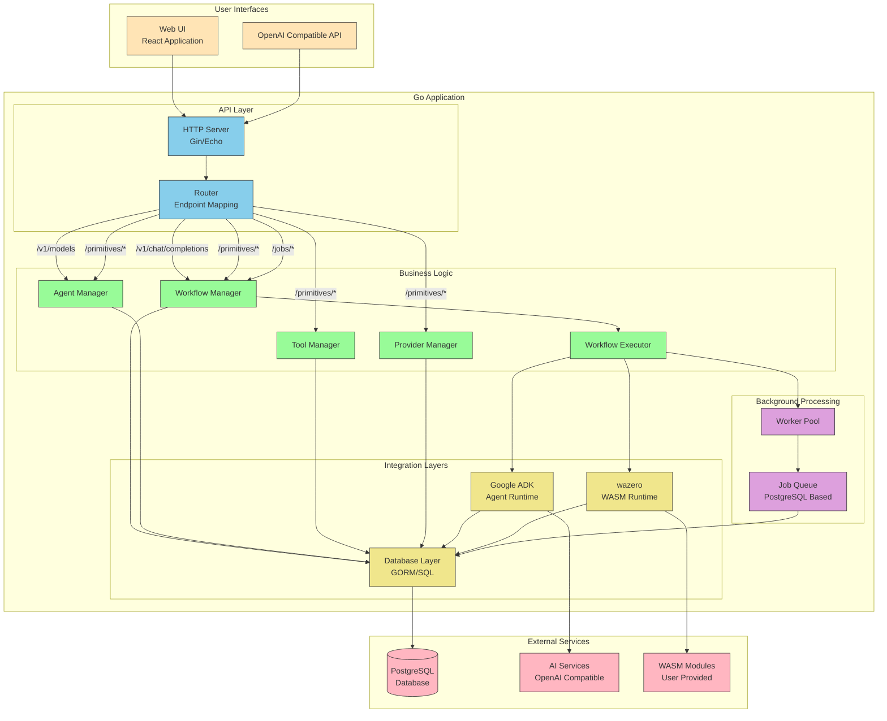

# Mule v2 - Component Interaction Diagram



## Component Interactions

### User Interface Layer
- **Web UI**: Static React application served by the embedded Go server
- **OpenAI Compatible API**: RESTful interface that mimics OpenAI's API for broad compatibility

### API Layer
- **HTTP Server**: Handles incoming HTTP requests using Gin or Echo framework
- **Router**: Maps endpoints to appropriate handlers

### Business Logic Layer
- **Workflow Manager**: Handles workflow CRUD operations and execution initiation
- **Agent Manager**: Manages agent configurations and direct agent execution
- **Tool Manager**: Handles tool definitions and configurations
- **Provider Manager**: Manages AI provider configurations
- **Workflow Executor**: Orchestrates the execution of workflows and their steps

### Integration Layers
- **Google ADK**: Provides the runtime for executing agents with their tools
- **wazero**: Executes WebAssembly modules in a secure sandboxed environment
- **Database Layer**: Abstracts database operations using GORM or direct SQL

### Background Processing
- **Worker Pool**: Configurable pool of goroutines for concurrent job execution
- **Job Queue**: PostgreSQL-based queue system for managing workflow jobs

### External Services
- **PostgreSQL Database**: Persistent storage for all configurations and job data
- **AI Services**: External OpenAI-compatible APIs
- **WASM Modules**: User-provided WebAssembly binaries

## Key Interaction Flows

### 1. Workflow Definition
```
UI/API → HTTP Server → Router → Workflow Manager → Database Layer → PostgreSQL
```

### 2. Workflow Execution Initiation
```
UI/API → HTTP Server → Router → Workflow Manager → Workflow Executor → Job Queue → PostgreSQL
```

### 3. Workflow Step Execution
```
Worker Pool → Job Queue → Workflow Executor → 
  ├── Agent Manager → Google ADK → AI Services
  └── WASM Executor → wazero → WASM Modules
```

### 4. Data Persistence
```
All Managers → Database Layer → PostgreSQL
```

## Data Flow Patterns

### Configuration Data
1. Created/updated via UI or API
2. Stored in PostgreSQL through Database Layer
3. Retrieved by managers when needed

### Execution Data
1. Jobs created in PostgreSQL when execution initiated
2. Workers claim jobs and update status
3. Step results stored as job progresses
4. Final results returned to user

### Real-time Communication
1. WebSocket connections for live execution updates
2. Direct streaming from agent executions
3. Status polling for job monitoring

## Security Boundaries

- **API Layer**: Authentication and rate limiting
- **Business Logic**: Input validation and sanitization
- **Integration Layers**: Secure credential handling
- **WASM Execution**: Sandboxed execution environment
- **Database**: Encrypted storage for sensitive data