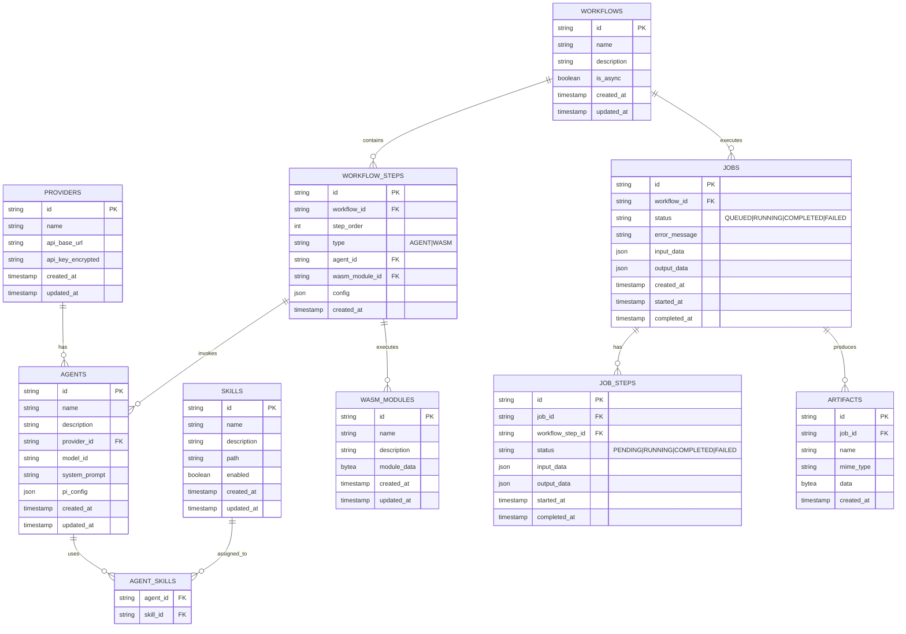

# Mule v2 - Data Model Diagram

```mermaid
erDiagram
    PROVIDERS {
        string id PK
        string name
        string api_base_url
        string api_key_encrypted
        timestamp created_at
        timestamp updated_at
    }
    
    SKILLS {
        string id PK
        string name
        string description
        string path
        boolean enabled
        timestamp created_at
        timestamp updated_at
    }
    
    AGENTS {
        string id PK
        string name
        string description
        string provider_id FK
        string model_id
        string system_prompt
        json pi_config
        timestamp created_at
        timestamp updated_at
    }
    
    AGENT_SKILLS {
        string agent_id FK
        string skill_id FK
    }
    
    WORKFLOWS {
        string id PK
        string name
        string description
        boolean is_async
        timestamp created_at
        timestamp updated_at
    }
    
    WORKFLOW_STEPS {
        string id PK
        string workflow_id FK
        int step_order
        string type "AGENT|WASM"
        string agent_id FK
        string wasm_module_id FK
        json config
        timestamp created_at
    }
    
    WASM_MODULES {
        string id PK
        string name
        string description
        bytea module_data
        timestamp created_at
        timestamp updated_at
    }
    
    JOBS {
        string id PK
        string workflow_id FK
        string status "QUEUED|RUNNING|COMPLETED|FAILED"
        string error_message
        json input_data
        json output_data
        timestamp created_at
        timestamp started_at
        timestamp completed_at
    }
    
    JOB_STEPS {
        string id PK
        string job_id FK
        string workflow_step_id FK
        string status "PENDING|RUNNING|COMPLETED|FAILED"
        json input_data
        json output_data
        timestamp started_at
        timestamp completed_at
    }
    
    ARTIFACTS {
        string id PK
        string job_id FK
        string name
        string mime_type
        bytea data
        timestamp created_at
    }
    
    PROVIDERS ||--o{ AGENTS : "has"
    AGENTS ||--o{ AGENT_SKILLS : "uses"
    SKILLS ||--o{ AGENT_SKILLS : "assigned_to"
    WORKFLOWS ||--o{ WORKFLOW_STEPS : "contains"
    WORKFLOW_STEPS ||--o{ AGENTS : "invokes"
    WORKFLOW_STEPS ||--o{ WASM_MODULES : "executes"
    WORKFLOWS ||--o{ JOBS : "executes"
    JOBS ||--o{ JOB_STEPS : "has"
    JOBS ||--o{ ARTIFACTS : "produces"
```

## Entity Descriptions

### PROVIDERS
Stores configuration for AI providers (OpenAI-compatible APIs):
- `api_base_url`: Base URL for the API (e.g., https://api.openai.com/v1)
- `api_key_encrypted`: Encrypted API key for secure storage

### SKILLS
Pi agent skills that can be assigned to agents:
- `name`: Unique name for the skill
- `description`: Human-readable description of what the skill does
- `path`: Directory path to the skill files
- `enabled`: Whether the skill is active and can be used

### AGENTS
AI agents powered by pi RPC runtime:
- `provider_id`: Reference to the AI provider
- `model_id`: Identifier for the specific model to use
- `system_prompt`: Instructions that define the agent's behavior
- `pi_config`: JSON configuration for pi runtime (thinking level, session options, etc.)

### AGENT_SKILLS
Many-to-many relationship between agents and skills.

### WORKFLOWS
Definition of ordered workflow executions:
- `is_async`: Whether executions should be asynchronous by default

### WORKFLOW_STEPS
Individual steps within workflows:
- `type`: Either "AGENT" for agent invocation or "WASM" for WASM execution
- `agent_id`: Reference to agent for agent steps
- `wasm_module_id`: Reference to WASM module for WASM steps
- `step_order`: Position in the workflow sequence

### WASM_MODULES
WebAssembly modules that can be executed as workflow steps:
- `module_data`: Binary data of the compiled WASM module

### JOBS
Instances of workflow executions:
- `status`: Current execution status
- `error_message`: Error message if the job failed
- `input_data`: Data provided when starting the job
- `output_data`: Results from the completed job

### JOB_STEPS
Execution records for individual workflow steps within jobs:
- `status`: Status of this specific step execution
- `input_data`: Data passed to this step
- `output_data`: Results from this step

### ARTIFACTS
Persistent data produced during job executions:
- `mime_type`: MIME type of the artifact data
- `data`: Binary content of the artifact
