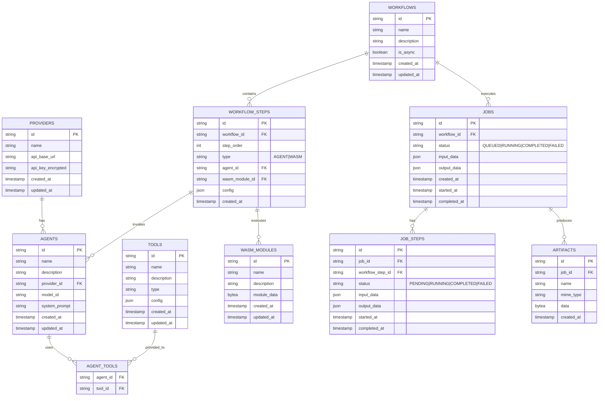

# Mule v2 - Data Model Diagram

## Entity Descriptions

### PROVIDERS
Stores configuration for AI providers (OpenAI-compatible APIs):
- `api_base_url`: Base URL for the API (e.g., https://api.openai.com/v1)
- `api_key_encrypted`: Encrypted API key for secure storage

### TOOLS
Represents available tools that can be used by agents:
- `type`: Type of tool (e.g., "http", "database", "memory")
- `config`: JSON configuration specific to the tool type

### AGENTS
AI agents combining a model, system prompt, and tools:
- `provider_id`: Reference to the AI provider
- `model_id`: Identifier for the specific model to use
- `system_prompt`: Instructions that define the agent's behavior

### AGENT_TOOLS
Many-to-many relationship between agents and tools.

### WORKFLOWS
Definition of ordered workflow executions:
- `is_async`: Whether executions should be asynchronous by default

### WORKFLOW_STEPS
Individual steps within workflows:
- `type`: Either "AGENT" for agent invocation or "WASM" for WASM execution
- `agent_id`: Reference to agent for agent steps
- `wasm_module_id`: Reference to WASM module for WASM steps
- `step_order`: Position in the workflow sequence

### WASM_MODULES
WebAssembly modules that can be executed as workflow steps:
- `module_data`: Binary data of the compiled WASM module

### JOBS
Instances of workflow executions:
- `status`: Current execution status
- `input_data`: Data provided when starting the job
- `output_data`: Results from the completed job

### JOB_STEPS
Execution records for individual workflow steps within jobs:
- `status`: Status of this specific step execution
- `input_data`: Data passed to this step
- `output_data`: Results from this step

### ARTIFACTS
Persistent data produced during job executions:
- `mime_type`: MIME type of the artifact data
- `data`: Binary content of the artifact