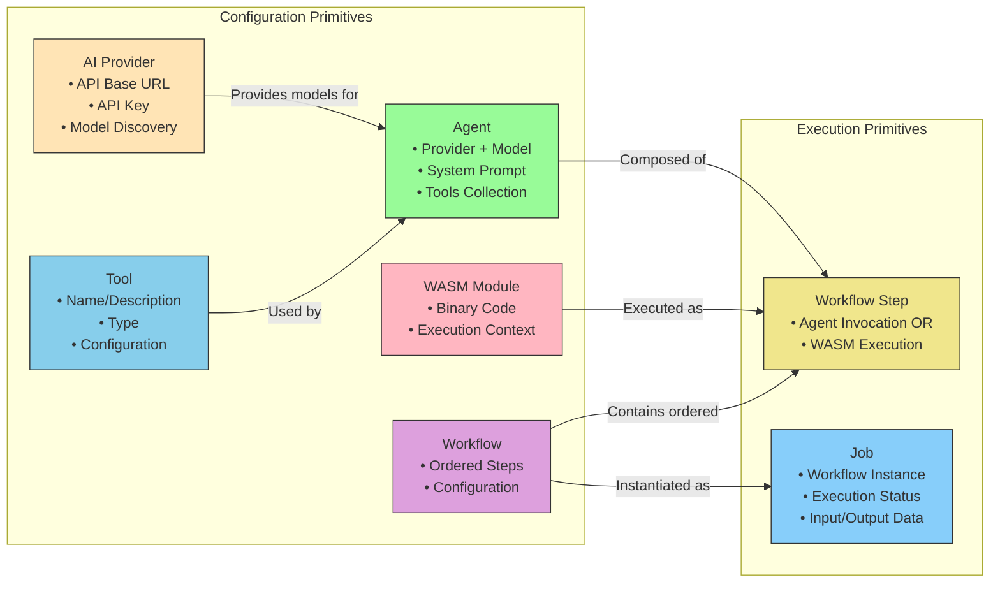

# Mule v2 - Core Primitives Relationship Diagram



## Primitive Relationships Explained

### Configuration Primitives (Static Definitions)

1. **AI Providers**
   - Define connection details to OpenAI-compatible APIs
   - Used to discover available models
   - Contain encrypted API credentials

2. **Tools**
   - Reusable functionality that can be provided to agents
   - Defined with specific configurations
   - Examples: HTTP clients, database connectors, memory operations

3. **Agents**
   - Combine a model from a provider with a system prompt and tools
   - Represent an AI persona with specific capabilities
   - Built using Google ADK patterns

4. **WASM Modules**
   - Compiled WebAssembly code for imperative execution
   - Provide custom logic that can't be expressed with agents
   - Executed securely using the wazero library

5. **Workflows**
   - Ordered collections of workflow steps
   - Define the sequence of operations to execute
   - Can mix agent invocations and WASM executions

### Execution Primitives (Runtime Instances)

1. **Workflow Steps**
   - Concrete instances of either:
     - Agent invocations (with specific agent reference)
     - WASM executions (with specific module reference)
   - Contain step-specific configuration
   - Part of a workflow definition

2. **Jobs**
   - Runtime instances of workflows
   - Track execution status and results
   - Contain input data and output data
   - Managed by the background job system

## Composition Hierarchy

```
Provider
└── Agent
    └── Workflow Step (Agent type)
        └── Workflow
            └── Job

Tool
└── Agent
    └── Workflow Step (Agent type)
        └── Workflow
            └── Job

WASM Module
└── Workflow Step (WASM type)
    └── Workflow
        └── Job
```

## Execution Flow

1. **Configuration**: Primitives are defined and stored in the database
2. **Composition**: Workflows are created by arranging workflow steps
3. **Instantiation**: A job is created when a workflow is executed
4. **Execution**: Each workflow step in the job is executed in order:
   - Agent steps invoke the agent runtime with the specified agent
   - WASM steps execute the specified WASM module
5. **Completion**: Results are collected and returned to the user