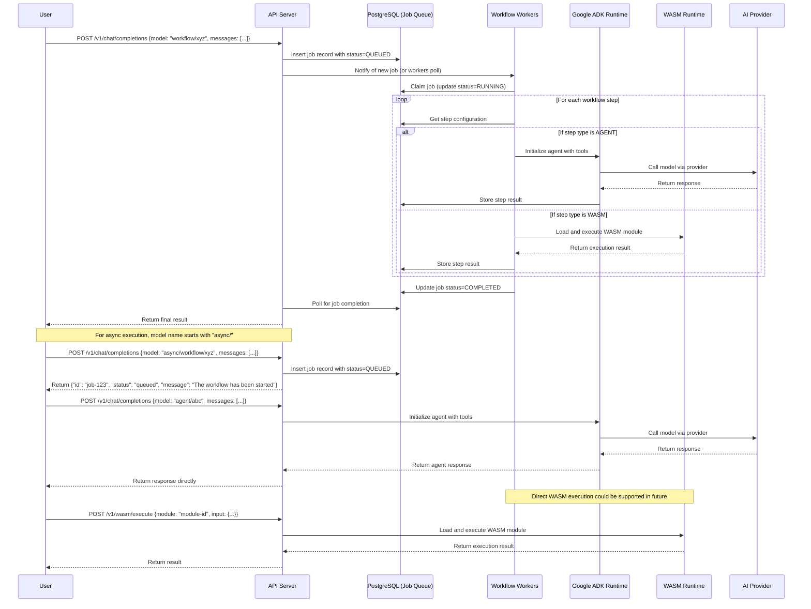

# Mule v2 - Workflow Execution Sequence Diagram

## Flow Description

### Synchronous Workflow Execution
1. User sends a request to execute a workflow synchronously
2. API server creates a job record in PostgreSQL with QUEUED status
3. Workflow workers pick up the job and begin execution
4. For each step in the workflow:
   - If it's an agent step, the worker initializes the agent with its tools and executes it via the AI provider
   - If it's a WASM step, the worker loads and executes the WASM module
5. Results from each step are stored in the database
6. When all steps complete, the job status is updated to COMPLETED
7. API server returns the final result to the user

### Asynchronous Workflow Execution
1. User sends a request to execute a workflow asynchronously (using "async/" prefix)
2. API server creates a job record and immediately returns a job ID to the user
3. Workflow execution proceeds in the background as described above
4. User can check the job status using the job ID

### Direct Agent Execution
1. User sends a request to execute an agent directly
2. API server initializes the agent and executes it immediately
3. Response is returned directly to the user without job queuing

## Key Components Interaction

- **API Server**: Handles incoming requests, manages job creation and result retrieval
- **PostgreSQL**: Acts as both persistent storage and job queue
- **Workflow Workers**: Execute workflow steps, managing the orchestration
- **Google ADK Runtime**: Provides the framework for agent execution
- **WASM Runtime**: Executes WebAssembly modules securely
- **AI Providers**: External services that provide the actual AI model capabilities