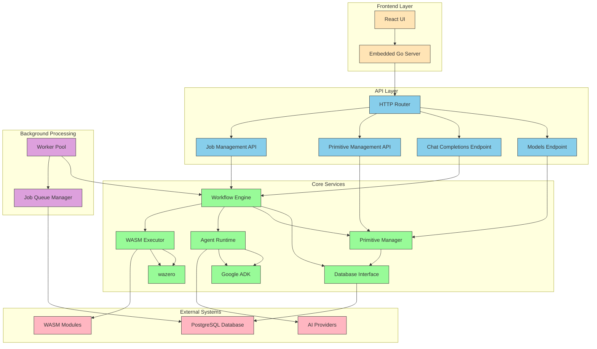

# Mule v2 - High-Level Software Architecture

## Architecture Components

### Frontend Layer
- **React UI**: Static React application compiled into the Go binary
- **Embedded Go Server**: Serves the static frontend assets with no external filesystem dependencies

### API Layer
- **HTTP Router**: Routes incoming requests to appropriate handlers
- **Models Endpoint**: Implements `GET /v1/models` to list available agents and workflows
- **Chat Completions Endpoint**: Implements `POST /v1/chat/completions` for executing agents and workflows
- **Primitive Management API**: CRUD operations for providers, tools, agents, and workflows
- **Job Management API**: Interface for monitoring and managing job executions

### Core Services

#### Primitive Manager
- Manages all core entities (providers, tools, agents, workflows)
- Provides database interface for persistent storage
- Handles validation and integrity checking

#### Workflow Engine
- Orchestrates workflow execution
- Manages job queue processing
- Coordinates between different step types

#### Agent Runtime
- Integrates with Google ADK for agent execution
- Manages tool binding and lifecycle
- Handles communication with AI providers

#### WASM Executor
- Uses wazero library for secure WASM execution
- Manages module loading and instantiation
- Provides host functions for Go integration

### External Systems
- **PostgreSQL Database**: Primary data store for all configuration and job execution data
- **AI Providers**: External OpenAI-compatible APIs
- **WASM Modules**: User-provided WebAssembly modules

### Background Processing
- **Worker Pool**: Configurable pool of workers for job execution
- **Job Queue Manager**: Manages job queuing and execution using PostgreSQL

## Data Flow

1. **Configuration Phase**:
   - User configures primitives through UI/API
   - Data stored in PostgreSQL via Primitive Manager

2. **Execution Phase**:
   - User initiates workflow/agent execution via API
   - Request queued as job in PostgreSQL
   - Worker picks up job and executes steps
   - Each step either invokes an agent (via Google ADK) or executes a WASM module (via wazero)
   - Results stored in database and streamed back to user

## Key Design Principles

1. **Single Binary Deployment**: All components compiled into a single Go binary with embedded frontend assets
2. **Database-Centric**: PostgreSQL used for both configuration storage and job queuing
3. **Secure Execution**: WASM modules executed in secure sandboxed environment
4. **Extensible Architecture**: Modular design allows for future enhancements
5. **Idiomatic Go**: Following Go best practices and minimal abstraction philosophy