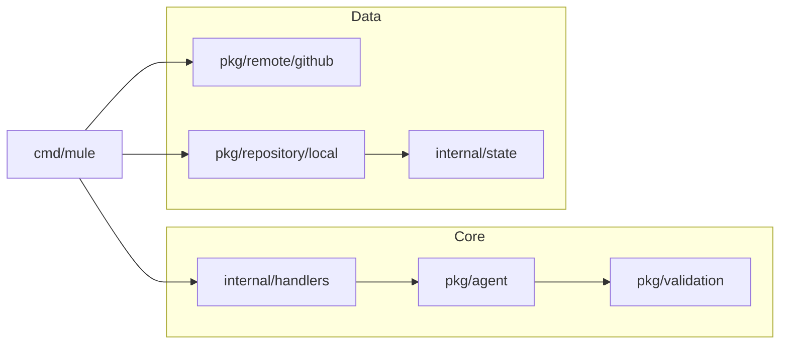

# Architecture Overview
## High-Level Components

```mermaid
graph LR
    A[cmd/mule] --> B[pkg/remote/github]
    A --> C[pkg/repository/local]
    A --> D[internal/handlers]
    D --> E[pkg/agent]
    E --> F[pkg/validation]
    C --> G[internal/state]

    subgraph Core
        D
        E
        F
    end

    subgraph Data
        G
        C
        B
    end
```
