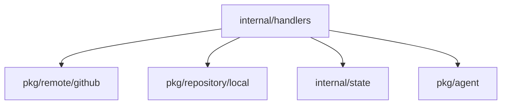

# internal/handlers Package
## Overview
Handles web API request routing and business logic implementation. Contains handlers for:
- GitHub integrations
- Local repository operations
- Logs management
- Settings configuration
- Repository state tracking

## Key Components
- **GitHubHandler**: Manages GitHub webhook and API interactions
- **LocalProviderHandler**: Handles local repository operations
- **LogHandler**: Implements log retrieval and filtering
- **SettingsHandler**: Manages settings persistence and updates

## Dependency Diagram

