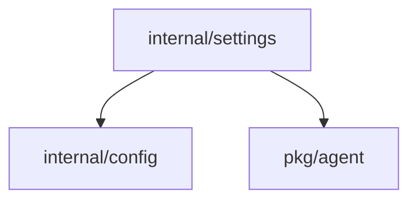

# internal/settings Package
## Overview
Manages application settings and agent/workflow configurations. Provides:
- Default setting definitions
- Settings persistence and retrieval
- Validation of configuration parameters

## Key Components
```go
type Settings struct {
    GitHubToken string
    AIProviders []AIProviderSettings
    Agents      []AgentOptions
    SystemAgent SystemAgentSettings
    Workflows   []WorkflowSettings
}

type AIProviderSettings struct {
    Provider string
    APIKey   string
    Server   string
}
```

## Dependency Diagram

