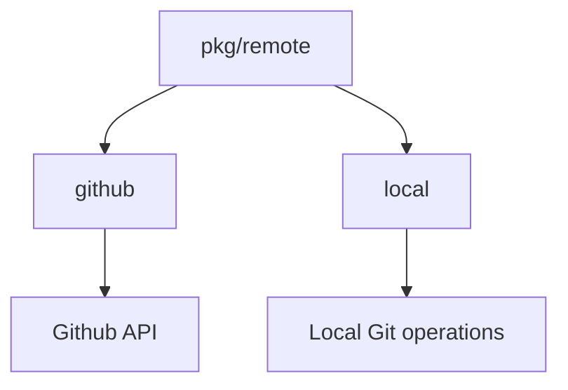

# pkg/remote Package
## Overview
Handles remote repository interactions and external service integrations. Contains sub-packages for:
- GitHub API operations
- Local repository management
- Remote connection abstraction

## Key Components
### Sub-packages
1. **github/**
   - Manages pull requests, issues, and comments
   - Implements GitHub workflow triggers
2. **local/**
   - Provides local repository operations
3. **types/**
   - Defines shared remote interface types

## Dependency Diagram

