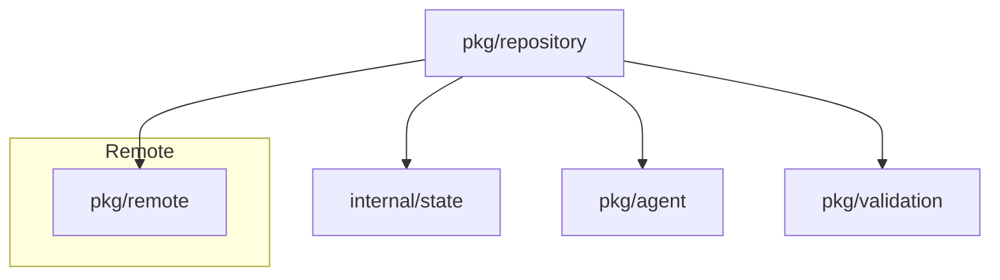

# pkg/repository Package
## Overview
Manages repository state, synchronization, and workflow execution tracking. Provides core functionality for:
- Repository metadata storage (path, schedule, last sync time)
- Remote provider integration management
- State tracking of repository operations
- Workflow coordination with agents
- Issue/PR change generation and tracking

## Key Components
```go
type Repository struct {
    Path           string                  `json:"path"`
    RemoteProvider remote.ProviderSettings `json:"remoteProvider"`
    Schedule       string                  `json:"schedule"`
    LastSync       time.Time               `json:"lastSync"`
    State          *Status                 `json:"status,omitempty"`
    RemotePath     string                  `json:"remotePath,omitempty"`
    Issues         map[int]*Issue          `-` // Not exported
    PullRequests   map[int]*PullRequest    `-`
    Mu             sync.RWMutex            `-`
    Locked         bool                    `json:"locked"`
    Logger         logr.Logger             `-`
    Remote         remote.Provider         `-`
}

// Changes represents generated modifications
type Changes struct {
    Files   []string
    Commits []string
    Summary string
}
```

## Dependency Diagram


## Core Functions
```go
func NewRepository(path string) *Repository
func (r *Repository) generateFromIssue(agents map[int]*agent.Agent, workflow struct{ Steps []agent.WorkflowStep }, issue *Issue) (bool, error)
func (r *Repository) updatePR(agents map[int]*agent.Agent, commentId int64) error
```

## Usage Example
```go
// Create a new repository instance
repo := NewRepository("/path/to/repo")

// Generate changes from an issue
workflow := Workflow{Steps: []WorkflowStep{{ID: "step1", AgentID: 1}}}
success, err := repo.generateFromIssue(agents, workflow, issue)
```
